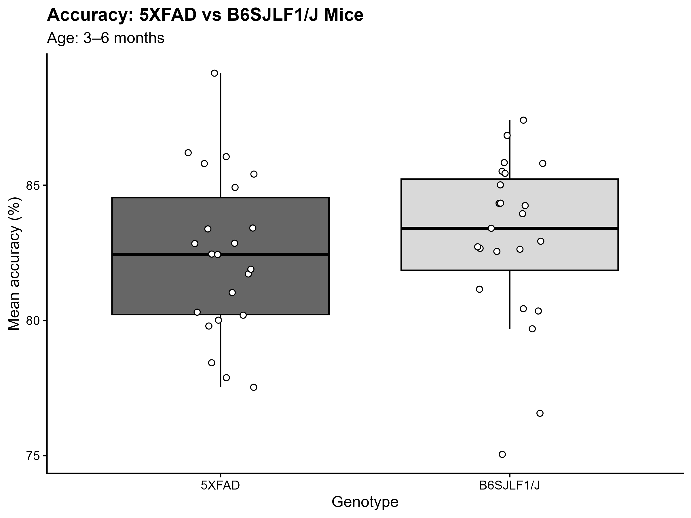

# MouseBytes 5-Choice Data Visualization

## Project overview

This project explores response accuracy in the five-choice serial reaction time task (5-CSRTT), a behavioural task used to study attention-related performance in mice. The analysis compares 5XFAD mice with B6SJLF1/J mice in the 3–6 month age category across selected probe-task schedules.

## Story Summary

Does response accuracy differ between 5XFAD mice, a model of Alzheimer’s disease, and B6SJLF1/J mice across different schedules of the five-choice serial reaction time task (5-CSRTT)?

The MouseBytes data reveal a more nuanced pattern than a simple difference between the two groups. Across four probe-task schedules, average response accuracy varies by schedule, while the difference between 5XFAD and B6SJLF1/J mice is not consistent in direction or magnitude. The group comparison therefore depends on the experimental schedule rather than showing one uniform pattern across all conditions.

Together, the visualizations highlight the importance of considering task conditions when examining attention-related behavioural performance in mouse models of Alzheimer’s disease. The scientific chart displays group means with 95% confidence intervals, while the public-facing chart presents the comparison in a more accessible format. These figures support a descriptive comparison, but they do not establish whether observed differences are statistically significant or caused by genotype. Further statistical analysis would be needed to evaluate the strength and reliability of the patterns.

## Data source

The data come from the MouseBytes dataset, *Weston-Project: Alzheimer’s mouse models dataset*.

* Source: [MouseBytes](https://mousebytes.ca)
* Dataset DOI: https://doi.org/10.7554/eLife.49630
* File used: `FB_AD_5Choice.csv`
* Data type: Aggregated behavioural data

## Analysis

The analysis selects records from the Probe session for the two genotypes and the 3–6 month age category. Accuracy values are averaged at the animal level for each experimental schedule.

## Visualizations

### Scientific Visualization

Group means with 95% confidence intervals.

## Limitations

These figures are descriptive and do not establish statistically significant genotype differences or causal effects. Animals may contribute observations to multiple schedules. The suitability of the comparison strain and the interpretation of individual schedules should be verified against the dataset documentation before drawing biological conclusions.

## Reproducibility

The R script `analysis.R` contains the data selection, summary calculations, visualization code, and figure-export commands. The source dataset must be available at the file path expected by the script.

## Additional Visualization: Accuracy Comparison

The following grayscale boxplot compares accuracy between 5XFAD and B6SJLF1/J mice.

