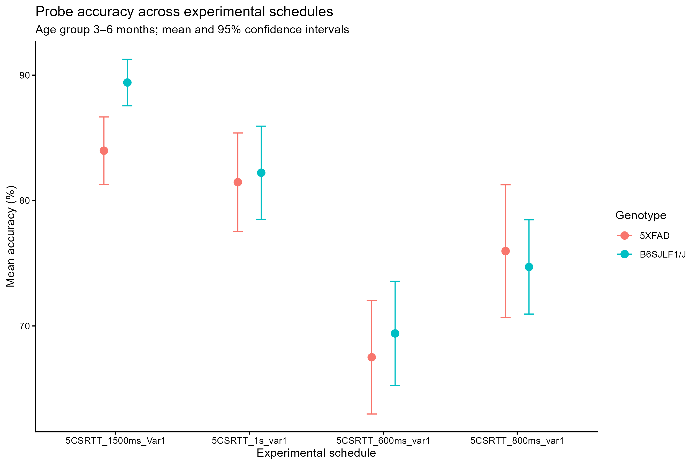
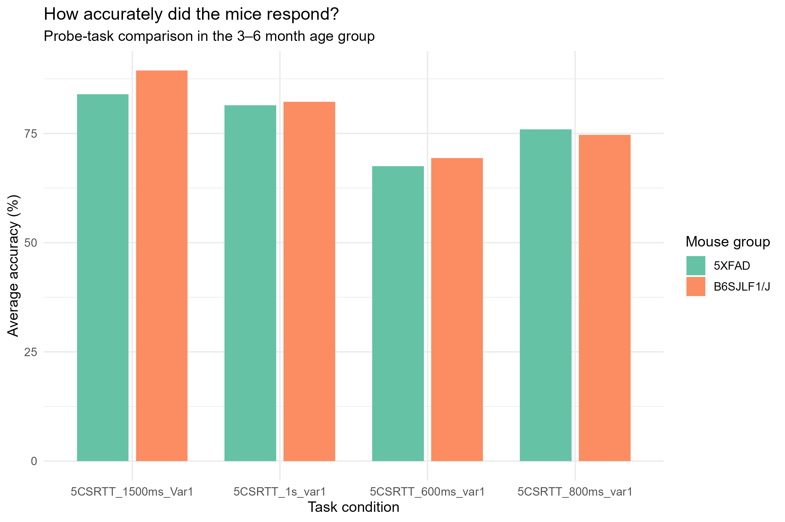

# MouseBytes 5-Choice Data Visualization

## Project overview

This project explores response accuracy in the five-choice serial reaction time task (5-CSRTT), a behavioural task used to study attention-related performance in mice. The analysis compares 5XFAD mice with B6SJLF1/J mice in the 3–6 month age category across selected probe-task schedules.
## Story Summary

This project explores whether response accuracy in the five-choice serial reaction time task (5-CSRTT), a behavioural task used to study attention-related performance in mice, differs between 5XFAD mice, a model of Alzheimer’s disease, and B6SJLF1/J mice. Using aggregated behavioural data from the MouseBytes *Weston-Project: Alzheimer’s mouse models dataset*, the analysis focuses on mice in the 3–6-month age category during probe sessions across four experimental schedules.

The visualizations compare average response accuracy between the two groups for each schedule. The scientific visualization presents group means with 95% confidence intervals, allowing readers to examine the observed differences and variability. The public-facing visualization presents the same comparison in a simpler bar-chart format for a broader audience.

The empirical story is that response accuracy varies across schedules, and the differences between the two groups are not uniform across all conditions. These descriptive patterns may help identify schedule-specific differences that could be explored in future research. However, the visualizations alone do not establish statistical significance, causation, or a definitive effect of genotype. Because animals may contribute observations across multiple schedules, the independence of observations should also be considered when conducting further statistical analyses.

## Data source

The data come from the MouseBytes dataset, *Weston-Project: Alzheimer’s mouse models dataset*.

* Source: [MouseBytes](https://mousebytes.ca)
* Dataset DOI: https://doi.org/10.7554/eLife.49630
* File used: `FB_AD_5Choice.csv`
* Data type: Aggregated behavioural data

## Analysis

The analysis selects records from the Probe session for the two genotypes and the 3–6 month age category. Accuracy values are averaged at the animal level for each experimental schedule.

## Visualizations

### Scientific visualization

Group means with 95% confidence intervals.

### Public-facing visualization

A bar chart designed for a broader audience.

## Limitations

These figures are descriptive and do not establish statistically significant genotype differences or causal effects. Animals may contribute observations to multiple schedules. The suitability of the comparison strain and the interpretation of individual schedules should be verified against the dataset documentation before drawing biological conclusions.

## Reproducibility

The R script `analysis.R` contains the data selection, summary calculations, visualization code, and figure-export commands. The source dataset must be available at the file path expected by the script.
